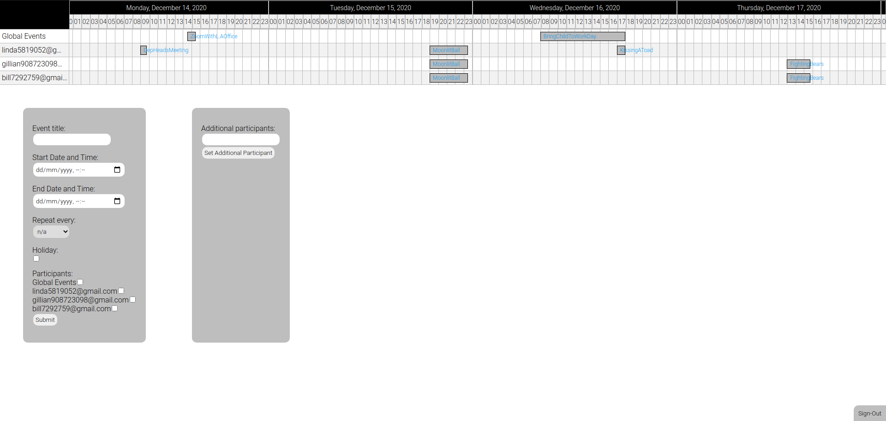
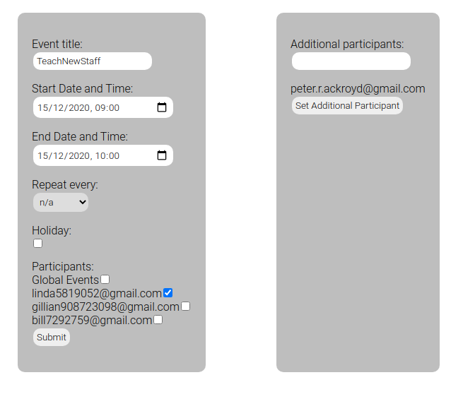

# Calendar Collaborator
Calendar Collaborator is an augmentation to google APIs. It allows you to add to existing google calendars with a UI and additional functionality designed for workplaces.

## Getting Started

This can be a little tricky as it requires a google API key. Go to the [google developer console](https://console.developers.google.com/) and create a new project, enable it for google calendars and then create credentials for a web client. After completing this go back the credentials page and create an API key and a client key adding them to a file in a git clone of the repo named apiGoogleConfig.json created in the src folder to the specs of the apiGoogleconfigMock.txt file. Then npm i and npm start in the client folder and sign in with a google account!

## Intended Use

Users login with a shared google account to add events to the calendar selecting participants. The calendar makes sure there are no overlaps with existing events for those participants before adding them to the calendar. Also allows booking holiday which checks if there is overlap with other holidays.
All events added are also automatically added to all participant calendars. 

## Example
Calendar is shown on top with input fields for adding items.

We can enter info to add another item here.

And the item appears in google calendars!

## Technologies
+React
+Google APIs